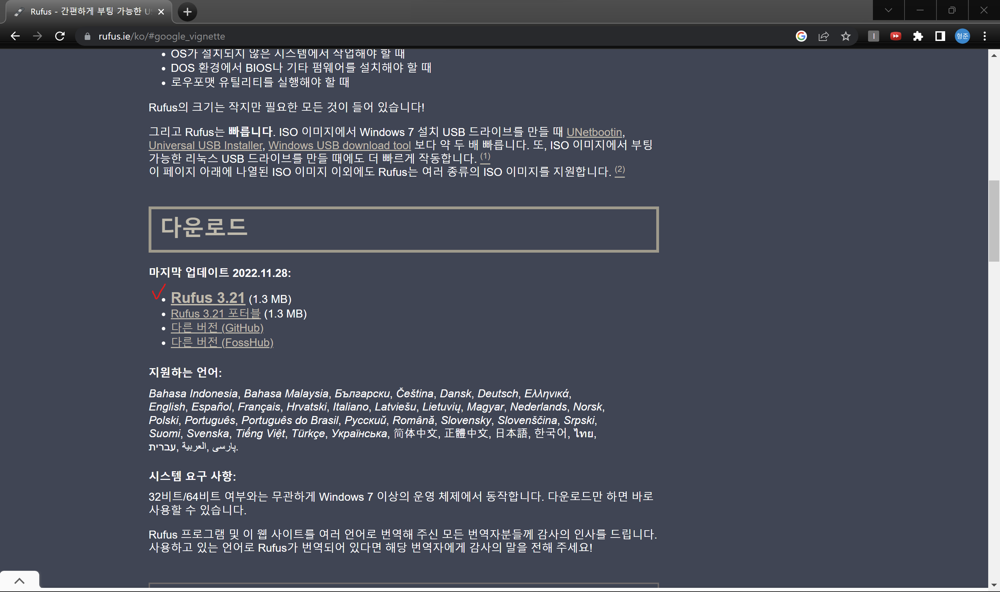

 

# 윈도우11에서 UBUNTU 20.04 듀얼부팅하기

## 1. 환경 세팅 목표

- UBUNTU 20.04 듀얼부팅
- UBUNTU 기본세팅(크롬, 한글, 와이파이 등)
- ~~GPU: NVIDIA GeForce RTX 3080 Ti Laptop~~
- ~~CUDA: 11.6~~
- ~~CUDNN: 8.4.0~~
- ~~Anaconda~~
- ~~Pytorch 설치~~
  `  `

이 글을 윈도우에서 멀티부팅을 통해 우분투 리눅스를 함께 사용합니다.` `
리눅스에서 딥러닝 환경 세팅하는 법을 바로 보고 싶은 분들께서는 다음 게시물을 참고해주세요!

---

## 2. 윈도우 11에서 UBUNTU 20.04 듀얼 부팅 세팅

 
기존에는 UBUNTU를 Virtual Box에서 사용해왔습니다. 그러다 현업과 가깝게 리눅스에서 개발 해보고 싶어 많은 시도를 하였습니다. 하지만 VM을 이용할 경우, GPU를 사용할 수 없다는 것을 삽질을 통해 경험하고 듀얼부팅을 하는 것으로 선택했습니다.

1. UBUNTU 이미지` `
2. 초기화된 USB

### 2-1. UBUNTU 이미지 다운

 
아래의 사이트로 접속하여, 우분투 버전 20.04를 다운 받습니다. 
[https://releases.ubuntu.com/focal/](https://releases.ubuntu.com/focal/) 
` `
참고로 22.04 버전을 설치하게 될 경우, CUDA가 12.0버전부터 호환되고 파이토치 버전 지원이 맞지 았습니다.` `

### 2-2. RUFUS 설치하기

RUFUS는 멀티부팅 이후, 우분투를 설치하기 위해 이미지 파일을 USB에 담기 위해 세팅을 도와주는 프로그램입니다.` `
하단 링크를 접속해 다운해주세요.` `
[https://rufus.ie/ko/#google_vignette](https://rufus.ie/ko/#google_vignette)` `
` `

RUFUS 설치가 끝나셨다면, USB를 노트북에 연결하고 아래의 그림 순서로 진행해주세요.
` `

1.RUFUS 실행하기` `
` `
(외장하드는 인식되지 않습니다. USB만 가능!)
` `
2. UBUNTU 이미지 선택` `
` `
` `
3. 시작 버튼 클릭` `
` `

 

### 2-3. BitLock 끄기(★★★)

 

### 2-4. BIOS 진입하기

 

### 2-5. BIOS 설정하기

 

---

## 3. 듀얼부팅으로 리눅스 실행하고, 기본 세팅하기
