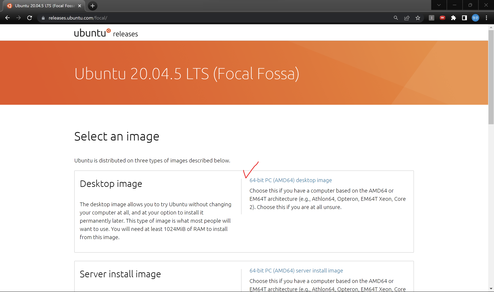

 

## 윈도우11에서 UBUNTU 20.04 듀얼부팅하기

### 1. 환경 세팅 목표

- UBUNTU 20.04 듀얼부팅
- UBUNTU 기본세팅(크롬, 한글, 와이파이 등)
- ~~GPU: NVIDIA GeForce RTX 3080 Ti Laptop~~
- ~~CUDA: 11.6~~
- ~~CUDNN: 8.4.0~~
- ~~Anaconda~~
- ~~Pytorch 설치~~
 

이 글은 윈도우에서 멀티부팅을 통해 우분투 리눅스를 함께 사용합니다. 
리눅스에서 딥러닝 환경 세팅하는 법을 바로 보고 싶은 분들께서는 다음 게시물을 참고해주세요! 
앞으로의 제가 삽질을 하지 않기를 바라며, 다른 분들에게도 도움이 됐으면 해서 글을 남깁니다!

---

### 2. 윈도우 11에서 UBUNTU 20.04 듀얼 부팅 세팅

 
기존에는 UBUNTU를 Virtual Box에서 사용해왔습니다. 그러다 현업과 가깝게 리눅스에서 개발 해보고 싶어 많은 시도를 하였습니다. 하지만 VM을 이용할 경우, GPU를 사용할 수 없다는 것을 삽질을 통해 경험하고 듀얼부팅을 하는 것으로 선택했습니다.

1. UBUNTU 이미지 
2. 초기화된 USB

#### 2-1. UBUNTU 이미지 다운

 
아래의 사이트로 접속하여, 우분투 버전 20.04를 다운 받습니다. 
[https://releases.ubuntu.com/focal/](https://releases.ubuntu.com/focal/) 
 
참고로 22.04 버전을 설치하게 될 경우, CUDA가 12.0버전부터 호환되고 파이토치 버전 지원이 맞지 았습니다. 

#### 2-2. RUFUS 설치하기

RUFUS는 멀티부팅 이후, 우분투를 설치하기 위해 이미지 파일을 USB에 담기 위해 세팅을 도와주는 프로그램입니다. 
하단 링크를 접속해 다운해주세요. 
[https://rufus.ie/ko/#google_vignette](https://rufus.ie/ko/#google_vignette) 
RUFUS 설치가 끝나셨다면, USB를 노트북에 연결하고 아래의 그림 순서로 진행해주세요.
 

1.RUFUS 실행하기 
 
(외장하드는 인식되지 않습니다. USB만 가능!)
 
2. UBUNTU 이미지 선택(선택 버튼 클릭) 
 
 
3. 시작 버튼 클릭 
 
 
4. 결과 확인 
 
 

#### 2-3. BitLock 끄기(★★★)

- 윈도우 11부터는 BitLock이라는 기능이 있는 것으로 알고 있습니다.
- 만약 BitLock을 끄지 않고, 멀티부팅을 실행하게 된다면 윈도우로의 접속을 못하게 됩니다.
- 따라서 BitLock

#### 2-4. BIOS 진입하기

- ctrl+f12 or f8
  - ctrl+f12로 설정할 경우, 어떤 운영체제로 접속할지 선택하여 들어갈 수 있습니다.
  - ctrl + f18의 경우, 처음부터 바로 접속할 수 있게 운영체제 순서를 바꿔놓을 수 있습니다.

---

## 3. 듀얼부팅으로 리눅스 실행하고, 기본 세팅하기

- 여기서부터는 완전히 리눅스 OS를 처음 시작하는 것과 같습니다.
- 따라서 인터넷에서 나온데로, 와이파이나 한영키 입력 등과 같이 자신이 필요한 부분들의 세팅을 합니다.
